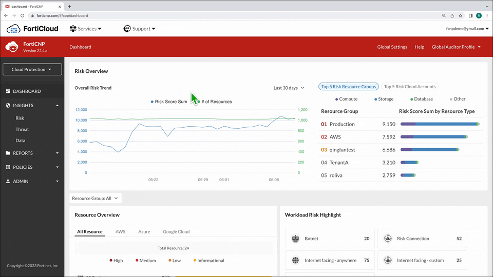

+++
archetype = "post"
title = "Dashboard"
weight = 1
+++

The "Cloud Protection" Dashboard provides a "Risk Overview" aggregate view across AWS, Azure, and Google Cloud.

1. In the "Overall Risk Trend" section, the blue line represents the trend for the risk score over the "Last 7 days" and 30 days.

2. Scrolling down, overview tiles have links to drill into "Insights" which populate granular search filters in the "Insights" section.
